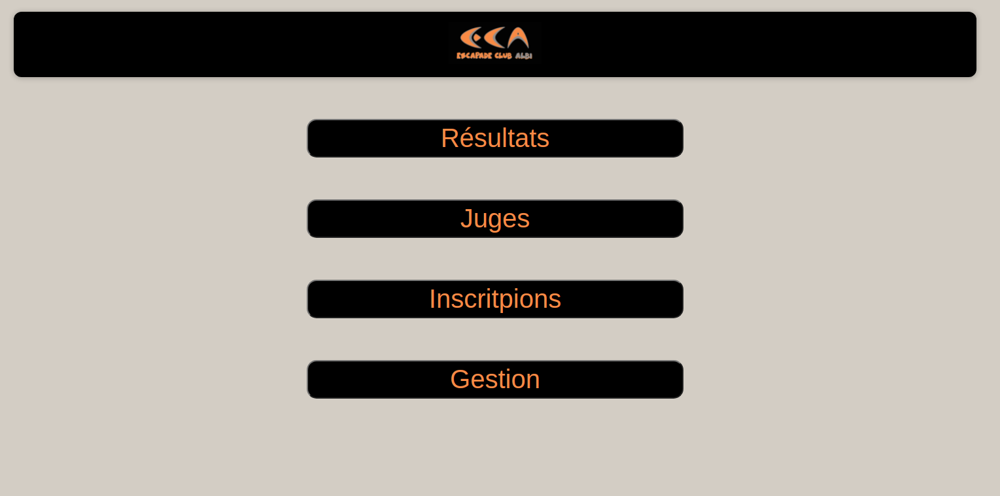
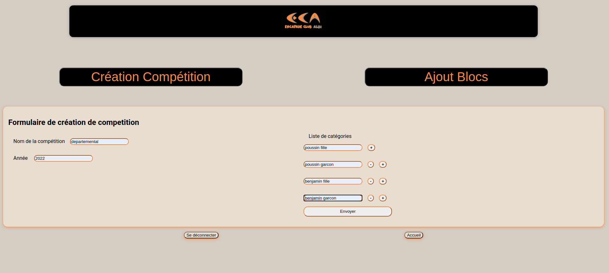
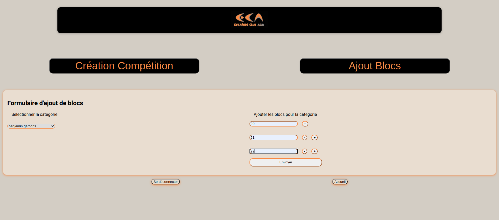
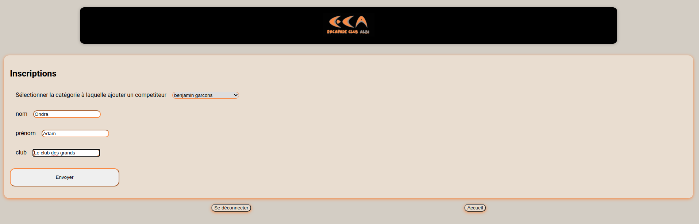
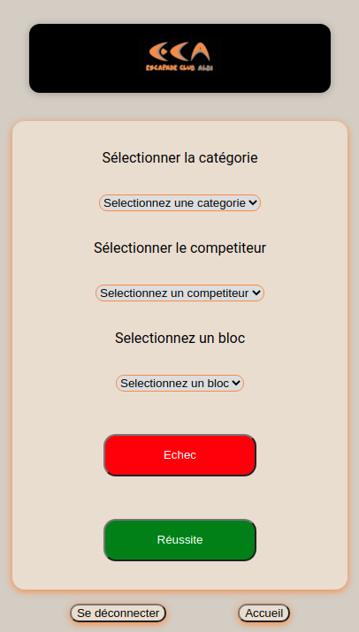
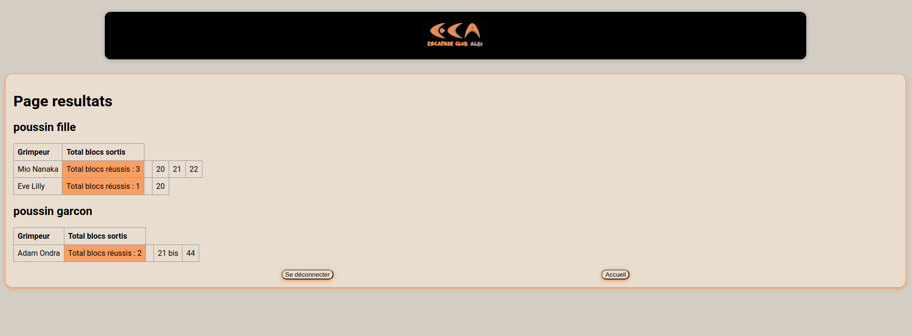

# Application frontend du système de gestion des compétitions de blocs de l'association Escapade Club Albi

Cette application est réservée en l'état à l'utilisation par le club d'escalade Escapade Club Albi. Son utilisation est néanmoins autorisée pour des usages non commerciaux à condition de retirer le nom et logo de l'association.

Elle fait partie du système pour lequel vous trouverez le détail [dans ce repo](https://github.com/MGeraud/CompetitionBloc)

Son utilisation est la suivante :  

## Page d'accueil : 

Les liens Gestion et Inscription demandent une authentification réservée aux gestionnaires de l'application. 
Le lien Juges demande une authentification réservée aux juges

## Page de Gestion des compétitions (Création de la compétition, de ses catégories et ajout des blocs pour chaque catégorie) :

Pour l'onglet "Création Compétition" vous devez rentrer le nom de la compétition, l'année ainsi que les catégories de cette compétition (vous pouvez en ajouter avec le bouton + ou les retirer avec le bouton -)

Pour l'onglet ajout de bloc, il vous faudra choisir la catégorie pour laquelle vous souhaitez ajouter des blocs, puis colonne de droite comme pour les catégories, vous ajoutez ou retirez les blocs que vous souhaitez (ils peuvent être de forme chiffrée ou par nom)

## Page des inscriptions :

Vous commencez par choisir la catégorie à laquelle appartient le compétiteur puis entrez son nom, prénom et club

## Page Juges :

Cette page est adaptée au format téléphone, car la plupart du temps les juges l'utiliseront pour valider ou non le passage d'un bloc.
Les juges sélectionnent la catégorie du compétiteur, son nom ainsi que le bloc sur lequel il fait un essai.

## Page Résultats :

Cette page présente les résultats de la compétition sous forme de tableau par catégorie. Sont mentionnés la catégorie, le nom et prénom des compétiteurs, le total de blocs réussis et la liste des blocs réussis.